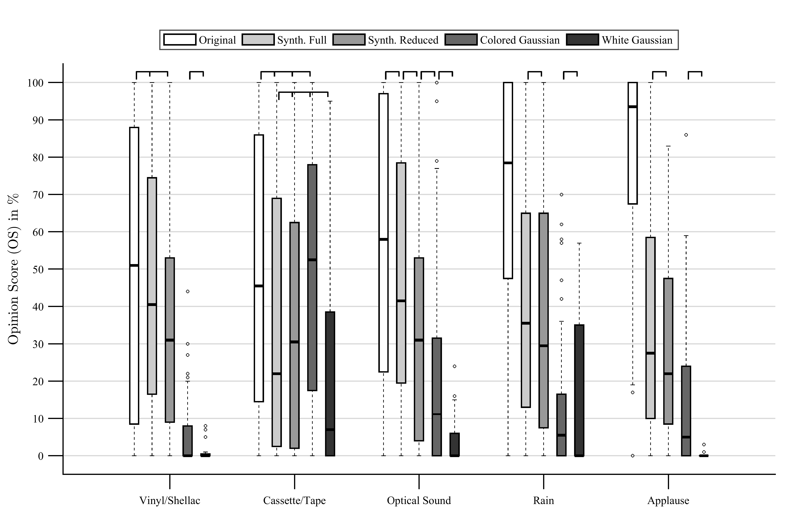

# Synthesis of Perceptually Plausible Multichannel Noise Signals Controlled by Real World Statistical Noise Properties

## Introduction

This website accompanies the JAES paper titled *Synthesis of Perceptually
Plausible Multichannel Noise Signals Controlled by Real World Statistical Noise
Properties* and provides supplemental material such as audio examples of
analyzed and synthesized signals. Also, the MATLAB code which was used to
generate the signals and the paper's figures is provided.

The page is optimized to be viewed with modern web browsers such as *Mozilla
Firefox* or *Google Chrome*. Users of *Microsoft Internet Explorer* **will not
be able to listen to the audio examples**. However, the download links next to
the audio players work just fine.


## MATLAB Code

Obtain the code by cloning the [Git
repository](https://github.com/JAAdrian/AES2017NoiseSynthesis) by calling

```
git clone git@github.com:JAAdrian/AES2017NoiseSynthesis.git
```
or download the latest version from the `master` branch as a [zip
file](https://github.com/JAAdrian/AES2017NoiseSynthesis/archive/refs/heads/master.zip)
and refer to the `README.md` document for further information on usage. The
code is licensed under BSD 3-Clause and, thus, be freely altered and used as
stated in detail in the license text.

## Citation

When you use the provided code in your own research, please be sure to cite the
following publication linked with the tools:

    @article{adrian2017synthesis,
        author = {Adrian, Jens-Alrik and Gerkmann, Timo and van de Par, Steven
        and Bitzer, Joerg},
        title = {Synthesis of Perceptually Plausible Multichannel Noise Signals
        Controlled by Real World Statistical Noise Properties},
        year = {2017},
        pages = {914–928},
        volume = {65},
        journal = {J. Audio Eng. Soc},
        number = {11},
        url = {http://www.aes.org/e-lib/browse.cfm?elib=19360},
    }


## Audio Examples

In the following table, exemplary audio samples of analyzed and synthesized
noise signals are presented. The audio samples include different types of noise
which were considered in the associated paper. In the synthesis, a reduced
parameter set was used as proposed in the paper.


<table class="audiotable">
    <colgroup>
        <col span="2">
        <col span="1" class="narrow">
        <col span="1">
        <col span="1" class="narrow">
    </colgroup>

    <thead>
        <th>Noise Type</th>
        <th>Original</th>
        <th></th>
        <th>Synthesis</th>
        <th></th>
    </thead>

    <tbody>
        <tr>
            <td>Cinema Optical Noise</td>
            <td class="tdaudio">
                <audio controls>
                    <source src="static/audio/CHACE.Smpl.1_Noise.wav" type="audio/wav">
                        Your browser does not support the audio element.
                </audio>
            </td>
            <td class="tdaudio">
                <audio controls>
                    <source src="static/audio/CHACE.Smpl.1_Noise_synth.wav" type="audio/wav">
                        Your browser does not support the audio element.
                </audio>
            </td>
        </tr>


        <tr>
            <td>Vinyl / Shellac</td>
            <td class="tdaudio">
                <audio controls>
                    <source src="static/audio/68400__danielsoniii__vinyl-hiss.wav" type="audio/wav">
                        Your browser does not support the audio element.
                </audio>
            </td>
            <td class="tdaudio">
                <audio controls>
                    <source src="static/audio/68400__danielsoniii__vinyl-hiss_synth.wav" type="audio/wav">
                        Your browser does not support the audio element.
                </audio>
            </td>
        </tr>


        <tr>
            <td>Cassette / Tape</td>
            <td class="tdaudio">
                <audio controls>
                <source src="static/audio/Cassette2(OH828_018_02_S2_M).wav" type="audio/wav">
                    Your browser does not support the audio element.
                </audio>
            </td>
            <td class="tdaudio">
                <audio controls>
                <source src="static/audio/Cassette2(OH828_018_02_S2_M)synth.wav" type="audio/wav">
                    Your browser does not support the audio element.
                </audio>
            </td>
        </tr>


        <tr>
            <td>Rain</td>
            <td class="tdaudio">
                <audio controls>
                <source src="static/audio/rain_03_13of34.wav" type="audio/wav">
                    Your browser does not support the audio element.
                </audio>
            </td>
            <td class="tdaudio">
                <audio controls>
                <source src="static/audio/rain_03_13of34_synth.wav" type="audio/wav">
                    Your browser does not support the audio element.
                </audio>
            </td>
        </tr>


        <tr>
            <td>Applause</td>
            <td class="tdaudio">
                <audio controls>
                <source src="static/audio/238784__staikov__cathedral-applauses-stereo.wav" type="audio/wav">
                    Your browser does not support the audio element.
                </audio>
            </td>
            <td class="tdaudio">
                <audio controls>
                <source src="static/audio/238784__staikov__cathedral-applauses-stereo_synth.wav" type="audio/wav">
                    Your browser does not support the audio element.
                </audio>
            </td>
        </tr>


        <tr>
            <td>Babble / Cafeteria Noise</td>
            <td class="tdaudio">
                <audio controls>
                <source src="static/audio/babble_short.wav" type="audio/wav">
                    Your browser does not support the audio element.
                </audio>
            </td>
            <td class="tdaudio">
                <audio controls>
                <source src="static/audio/babble_short_synth.wav" type="audio/wav">
                    Your browser does not support the audio element.
                </audio>
            </td>
        </tr>
    </tbody>
</table>


## Figure Generation

The MATLAB and data files which were used to create the more important figures
in the paper are packed in this [zip file](static/data_and_scripts.zip). The
file contains two folders. The folder `ListeningTest` contains subject data and
evaluation scripts. The folder `PlotScripts` contains the scripts which produce
the following plots:

<table class="scripttable">
    <thead>
        <th>Figure No.</th>
        <th>Script Name</th>
    </thead>

    <tbody>
        <tr>
            <td>
                Fig. 4
            </td>
            <td class="scriptstyle">
                <code>plotFDLS.m</code>
            </td>
        </tr>

        <tr>
            <td>
                Fig. 5
            </td>
            <td class="scriptstyle">
                <code>plotParetos.m</code>
            </td>
        </tr>

        <tr>
            <td>
                Fig. 7
            </td>
            <td class="scriptstyle">
                <code>plotErrorDistribution.m</code>
            </td>
        </tr>

        <tr>
            <td>
                Fig. 8
            </td>
            <td class="scriptstyle">
                <code>plotListeningResults.m</code>
            </td>
        </tr>
    </tbody>
</table>


## Listening Test Results

<figure>
    
    <figcaption>Opinion scores obtained for five noise types with five
    conditions each. 12 subjects participated in this test, rating six signals
    for each condition (box). Pairs for which the null hypothesis of equal
    medians could not be rejected are marked with brackets. For multiple mutual
    equality the brackets span multiple groups.</figcaption>
</figure>
